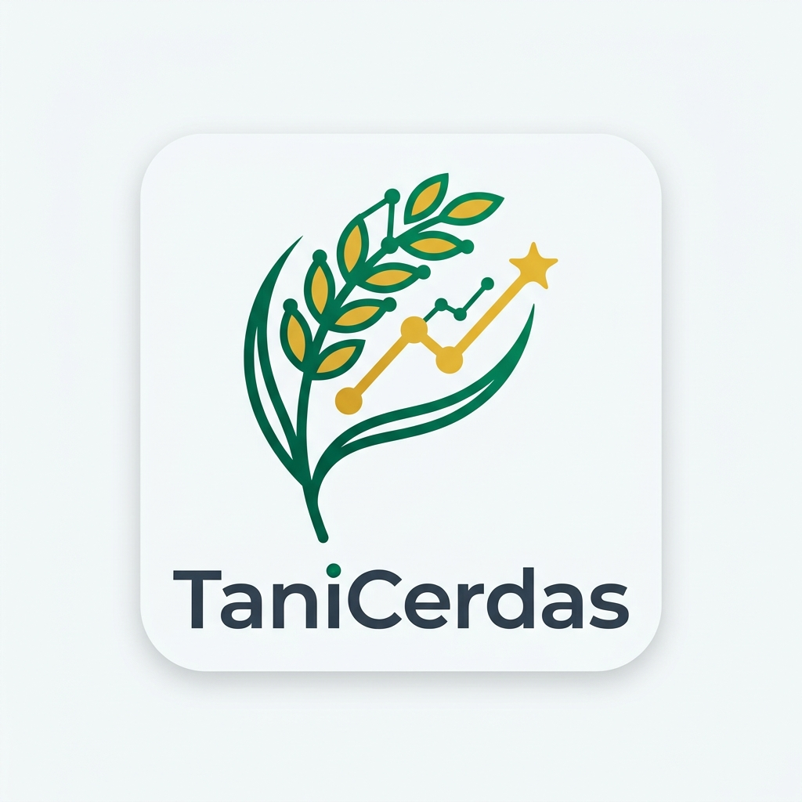
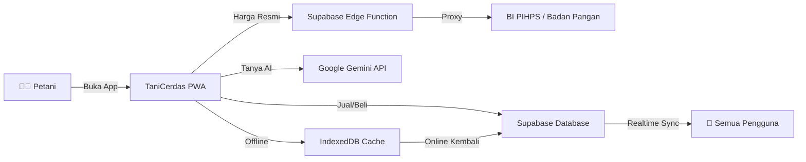

<div align="center">
  
  <h1>🌾 TaniCerdas AI</h1>
  <p><strong>Platform Intelijen Harga Komoditas & Pasar Digital B2B untuk Petani Indonesia</strong></p>
  <p><em>Melawan manipulasi harga tengkulak dengan transparansi data dan kecerdasan buatan.</em></p>

  <p>
    <a href="https://petani-cerdas.vercel.app"></a>
    <a href="https://github.com/Azyte/Petani-Cerdas/releases/latest"></a>
  </p>

  <p>
    
    
    
    
    
    
  </p>
</div>

---

## 📖 Apa Itu TaniCerdas?

**TaniCerdas AI** adalah platform agritech *open-source* berbasis web yang didesain khusus untuk **petani Indonesia**. Platform ini menyediakan akses transparan ke data harga komoditas resmi dari **Bank Indonesia (BI PIHPS)**, pasar digital B2B untuk jual-beli hasil tani, dan asisten AI cerdas — semuanya dikemas dalam satu aplikasi ringan yang bisa diakses lewat browser maupun diinstall sebagai aplikasi Android.

### 🎯 Mengapa TaniCerdas Dibutuhkan?

> *"Di Indonesia, jutaan petani masih menjual hasil panen mereka dengan harga yang ditentukan sepihak oleh tengkulak. Tanpa akses informasi harga pasar yang transparan, petani kehilangan potensi pendapatan hingga 30-40%."*

TaniCerdas hadir untuk **menutup kesenjangan informasi** ini dengan memberikan petani:
- ✅ Data harga resmi langsung dari sumber pemerintah
- ✅ Platform jual-beli digital tanpa perantara
- ✅ Asisten AI yang membantu strategi penjualan
- ✅ Komunitas sesama petani untuk saling berbagi informasi

---

## ✨ Fitur Lengkap

### 📊 Dashboard Harga Real-Time
Pantau harga acuan komoditas dari **34 provinsi** secara langsung. Data diambil otomatis dari sistem PIHPS Bank Indonesia melalui mekanisme proxy yang aman.

### 🏪 Pasar B2B Digital (LIVE)
Pasar online yang **publik dan real-time** — petani bisa memasang dagangan mereka (pangan, peternakan, perkebunan) dan pembeli dari mana saja bisa melihat serta langsung menghubungi penjual via **WhatsApp** dengan satu klik.

> 💡 **Catatan:** Semua listing tersimpan di cloud (Supabase) dan dapat diakses oleh siapa saja secara global, bukan hanya di perangkat lokal.

### 🤖 Asisten AI Cerdas (Gemini)
Chatbot berbasis **Google Gemini** yang memahami konteks harga komoditas saat ini. Bisa memberikan:
- Analisis apakah harga jual Anda **wajar** atau **terlalu murah**
- Saran strategi penjualan berdasarkan tren pasar
- Rekomendasi waktu terbaik untuk menjual

### 📈 Tren & Grafik Interaktif
Visualisasi pergerakan harga historis komoditas menggunakan **Chart.js** — lengkap dengan data crowdsource dari sesama petani.

### 👥 Komunitas & Leaderboard
Sistem gamifikasi yang membuat petani semangat berkontribusi:
- **XP & Level** — Dapatkan poin setiap kali melaporkan harga atau memasang listing
- **Peringkat** — Bersaing dengan petani lain di leaderboard
- **Pencapaian** — Kumpulkan badge dan achievement

### 📱 PWA + Mode Offline
- Install langsung dari browser tanpa Play Store
- **Tetap berfungsi tanpa internet** — data di-cache menggunakan IndexedDB
- Sinkronisasi otomatis saat koneksi kembali

### 🎨 UI/UX Premium
- Efek **Ripple** di setiap tombol dan elemen interaktif
- Mikro-animasi dan transisi halus
- Desain **Glassmorphism** dengan palet Emerald khas pertanian
- 100% responsif untuk mobile & desktop

---

## 🛠️ Tech Stack

| Teknologi | Kategori | Kegunaan Utama |
|-----------|----------|----------------|
| **HTML5 + Vanilla JS** | Frontend | Pondasi super ringan & *blazing fast* |
| **Vanilla CSS3** | Frontend | *Custom design system* tanpa *framework* berat |
| **Vite** | Frontend | *Build tool* + HMR (Hot Module Replacement) |
| **Chart.js** | Frontend | Visualisasi grafik data yang interaktif |
| **vite-plugin-pwa** | Frontend | *Service Worker* & PWA *Manifest* |
| **Supabase (PostgreSQL)** | Backend | Database & sinkronisasi data *realtime* |
| **Supabase Edge Functions**| Backend | *Serverless API* (menggunakan Deno) |
| **Google Gemini API** | AI Engine | Model dasar untuk asisten pertanian AI |
| **ScraperAPI** | Integrasi | Proxy pengambil data dari web BI PIHPS |
| **Vercel** | Deployment | *Hosting* web & CI/CD otomatis |
| **PWABuilder** | Deployment | Generator *Android APK packaging* |
| **GitHub Releases** | Deployment | Platform distribusi file `.apk` |

---

## 📡 Arsitektur Sistem



### Alur Pengambilan Data PIHPS

| Metode | Cara Kerja | Cocok Untuk |
|--------|-----------|-------------|
| ☁️ **Cloud Proxy** | Frontend → Supabase Edge → ScraperAPI → BI PIHPS | Pengguna umum |
| 🏠 **Local Fetcher** | Jalankan `npm run sync-pihps` dari terminal | Admin / Developer |

---

## 🚀 Panduan Instalasi

### Prasyarat
- **Node.js** v18+
- **NPM** v9+
- Akun [Supabase](https://supabase.com) (gratis)

### Setup Lokal

```bash
# 1. Clone repositori
git clone https://github.com/Azyte/Petani-Cerdas.git
cd Petani-Cerdas

# 2. Install dependensi
npm install

# 3. Konfigurasi environment
cp .env.example .env
# Isi VITE_SUPABASE_URL dan VITE_SUPABASE_ANON_KEY

# 4. Jalankan development server
npm run dev
# → Buka http://localhost:5173

# 5. Build untuk produksi
npm run build
```

### Environment Variables

| Variable | Deskripsi |
|----------|-----------|
| `VITE_SUPABASE_URL` | URL project Supabase Anda |
| `VITE_SUPABASE_ANON_KEY` | Anon/Public key Supabase |

---

## 📦 Download APK

Anda bisa langsung download dan install TaniCerdas sebagai aplikasi Android:

👉 **[Download TaniCerdas.apk (Latest Release)](https://github.com/Azyte/Petani-Cerdas/releases/latest)**

> **Cara Install:** Download APK → Buka di HP Android → Izinkan sumber tidak dikenal → Selesai! 🎉

---

## 🗺️ Roadmap

- [x] Dashboard harga real-time (BI PIHPS)
- [x] Crowdsource pelaporan harga
- [x] Asisten AI (Gemini)
- [x] Pasar B2B publik (Supabase)
- [x] PWA + Mode Offline
- [x] Gamifikasi (XP, Level, Achievement)
- [x] Android APK
- [ ] Notifikasi push saat harga berubah drastis
- [ ] Fitur upload foto produk di Pasar B2B
- [ ] Multi-bahasa (Jawa, Sunda, Minang)
- [ ] Integrasi cuaca untuk rekomendasi tanam

---

## 🤝 Kontribusi

Kontribusi sangat diterima! Silakan:
1. **Fork** repositori ini
2. Buat **branch** fitur (`git checkout -b fitur/fitur-baru`)
3. **Commit** perubahan (`git commit -m 'Menambahkan fitur baru'`)
4. **Push** ke branch (`git push origin fitur/fitur-baru`)
5. Buat **Pull Request**

Untuk perubahan besar, silakan buka **Issue** terlebih dahulu untuk berdiskusi.

---

## 📄 Lisensi

Didistribusikan di bawah lisensi **MIT**. Lihat `LICENSE` untuk informasi lebih lanjut.

---

<div align="center">
  <br/>
  
  <br/><br/>
  <strong>TaniCerdas AI</strong>
  <br/>
  <em>Menghubungkan petani tradisional dengan kekuatan intelijen data modern.</em>
  <br/><br/>
  <sub>Dibangun dengan 💚 untuk kesejahteraan Petani Nusantara</sub>
  <br/>
  <sub>© 2026 <a href="https://github.com/Azyte">Azyte</a> — Hak cipta dilindungi</sub>
  <br/><br/>
  <a href="https://petani-cerdas.vercel.app">🌐 Live Demo</a> •
  <a href="https://github.com/Azyte/Petani-Cerdas/releases/latest">📱 Download APK</a> •
  <a href="https://github.com/Azyte/Petani-Cerdas/issues">🐛 Laporkan Bug</a>
</div>
